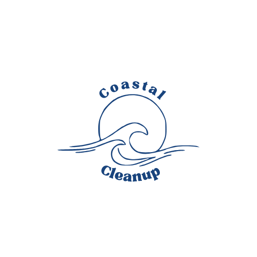

# Coatal Cleanup

Coastal Cleanup is a non-profit organization striving to keep the planet the way we found it. Our website highlights the importance of combating water pollution through informative content and community engagement. Users can easily navigate through pages, read and find information, engage in interactive learning, find and host events, and access member services, all within a beautiful beach aesthetic.

# Website Link
- https://coastal-cleanup-2.onrender.com/

# Usage
- Use command git clone in your local terminal
- git clone https://github.com/zt8media/Coastal-Cleanup.git
- like this ↑

# Features
- **Easy Navigation**: Users can easily navigate through different pages.
- **Informative Content**: Easily accessible and readable information about water pollution.
- **Interactive Learning**: Engage with interactive content to learn about environmental issues.
- **Event Finding & Hosting**: Find and host events with an interactive calendar.
- **Member Services**: Access special services for members.

# Pages
### Home
- Find information who we are and about our mission.
  
### Learn More
- Access detailed information about water pollution.
- View statistics and facts.
- Check the weather using an integrated weather API.

### Events
- Use an interactive calendar to insert and view events for beach cleanups.
- Using an integrated calendar, google map and speech recognition API.

### Contact
- Get in touch with us for more information or to become a volunteer.

# Resources

- https://openweathermap.org/api
- https://developers.google.com/maps/documentation/javascript
- https://fullcalendar.io/
- https://developer.mozilla.org/en-US/docs/Web/API/SpeechRecognition
- https://animate.style/
- https://cdnjs.cloudflare.com/ajax/libs/font-awesome/6.1.1/css/all.min.css
- https://render.com/
- https://www.freesqldatabase.com/
- https://dribbble.com/
